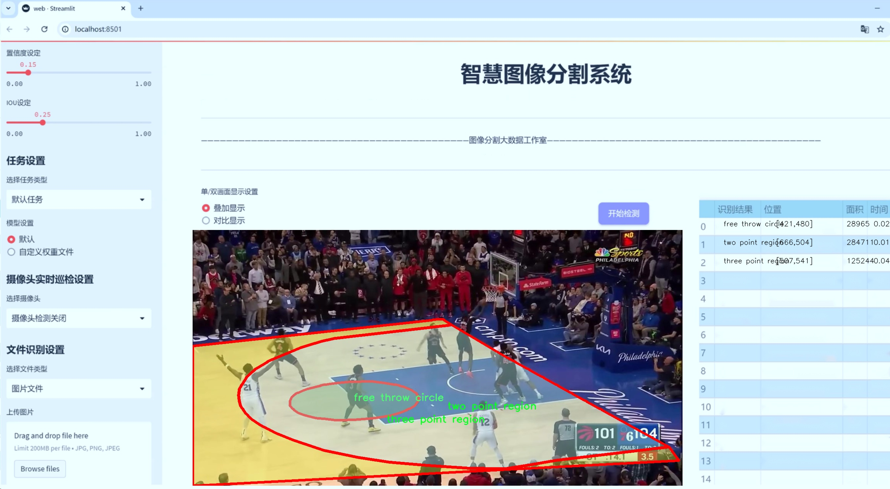
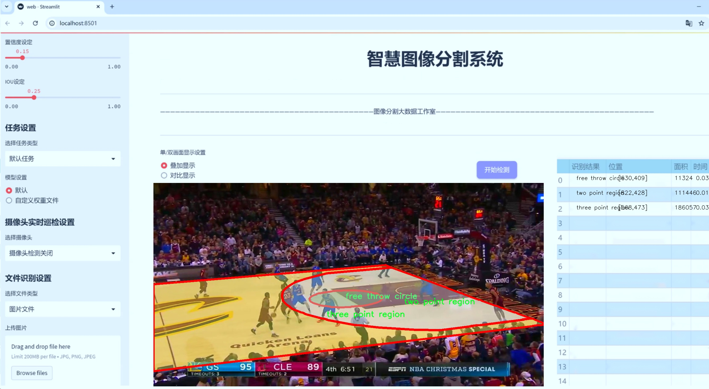
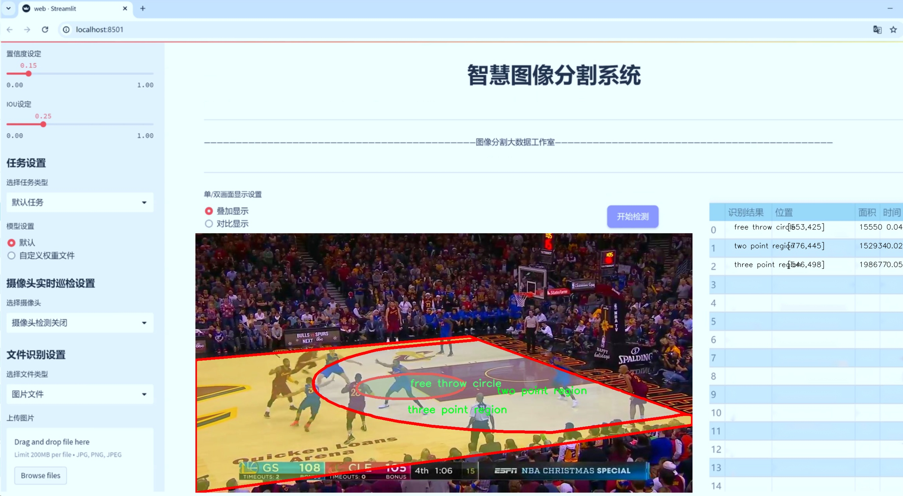
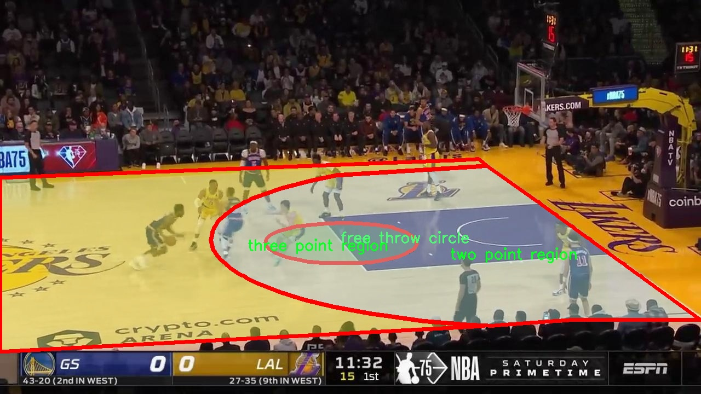
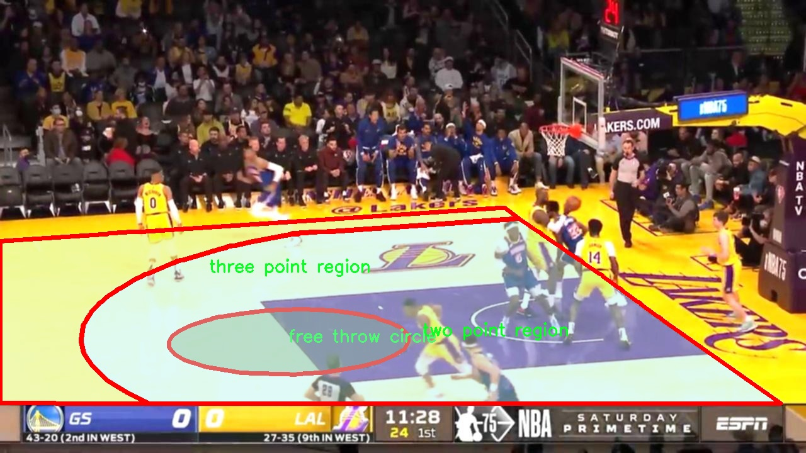
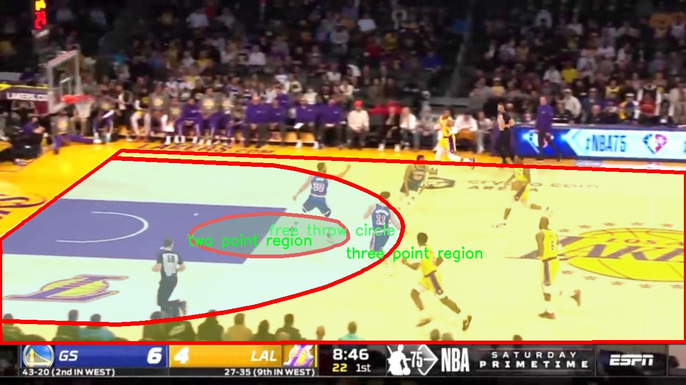
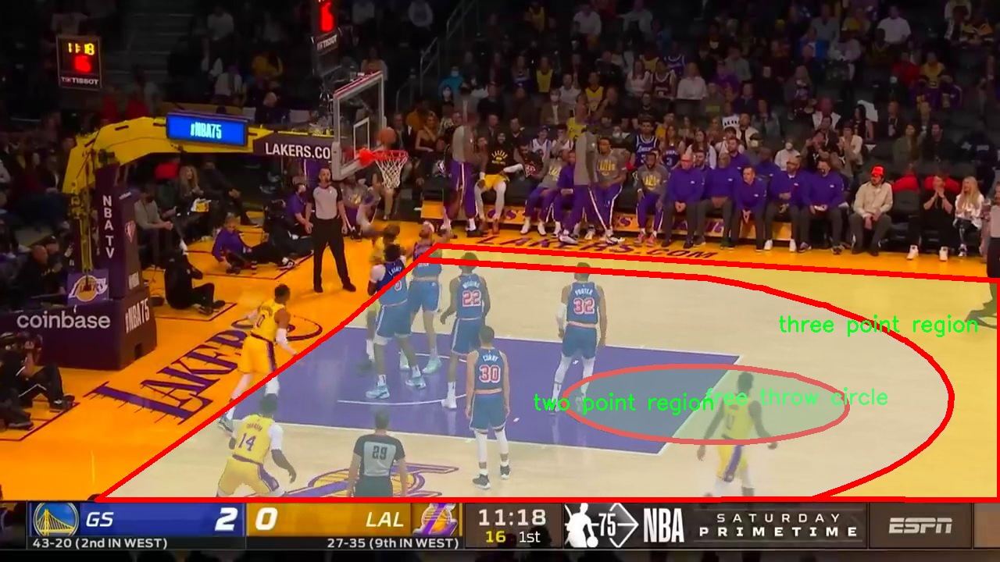
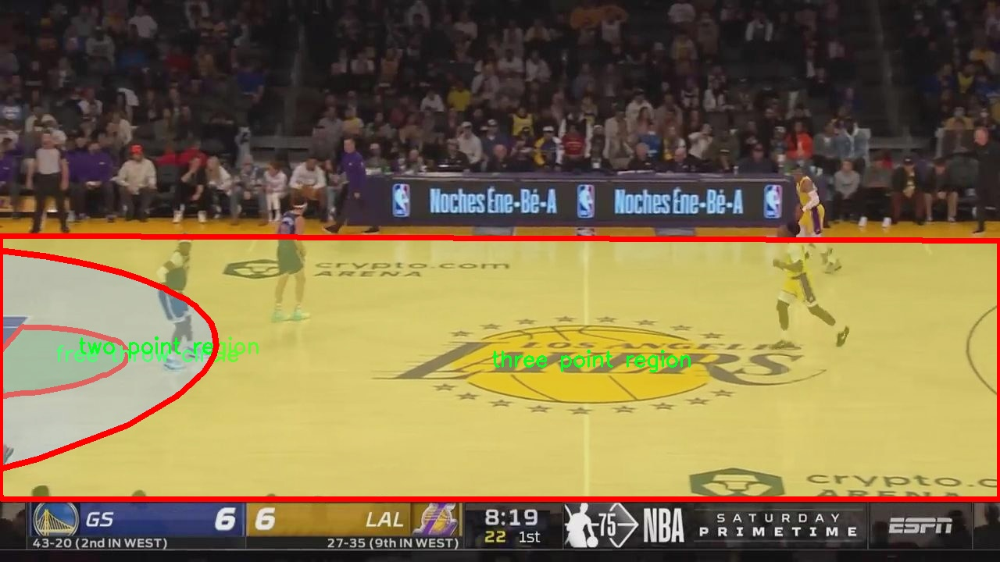

# 篮球场区域分割系统源码＆数据集分享
 [yolov8-seg-GhostHGNetV2＆yolov8-seg-EfficientFormerV2等50+全套改进创新点发刊_一键训练教程_Web前端展示]

### 1.研究背景与意义

项目参考[ILSVRC ImageNet Large Scale Visual Recognition Challenge](https://gitee.com/YOLOv8_YOLOv11_Segmentation_Studio/projects)

项目来源[AAAI Global Al lnnovation Contest](https://kdocs.cn/l/cszuIiCKVNis)

研究背景与意义

随着计算机视觉技术的快速发展，深度学习在图像处理领域的应用日益广泛，尤其是在目标检测和实例分割任务中。篮球作为一项全球广受欢迎的运动，其比赛过程中的战术分析、运动员表现评估等均依赖于对场地区域的精准识别与分割。传统的篮球场区域分析方法往往依赖于人工标注和经验判断，效率低下且易受主观因素影响。因此，基于深度学习的自动化篮球场区域分割系统的研究具有重要的现实意义。

本研究旨在基于改进的YOLOv8模型，构建一个高效的篮球场区域分割系统。YOLO（You Only Look Once）系列模型以其高效的实时检测能力和较高的准确性在目标检测领域取得了显著的成果。YOLOv8作为该系列的最新版本，进一步优化了模型结构和训练策略，能够在保证检测精度的同时提升处理速度，适合于实时应用场景。通过对YOLOv8模型的改进，结合特定的篮球场区域分割需求，可以实现对篮球场内不同区域的精准识别与分割，从而为后续的战术分析和数据挖掘提供坚实的基础。

在本研究中，我们使用的数据集包含5000张图像，涵盖了三个主要类别：罚球圈、三分区域和两分区域。这些类别的选择不仅符合篮球比赛的基本规则，也为模型的训练提供了丰富的样本数据。通过对这些区域的准确分割，系统能够为教练和运动员提供更为直观的数据支持，帮助他们分析比赛中的得分策略和空间利用情况。此外，数据集的规模和多样性也为模型的泛化能力提供了保障，使其能够适应不同场地和比赛环境下的应用需求。

研究的意义不仅体现在技术层面，更在于其对篮球运动的促进作用。通过自动化的区域分割系统，教练团队可以更高效地进行战术分析，运动员也能在训练中更好地理解不同区域的战术价值。这种基于数据驱动的分析方法，将为篮球运动的科学化和系统化发展提供新的思路和工具。

综上所述，基于改进YOLOv8的篮球场区域分割系统的研究，不仅能够推动计算机视觉技术在体育领域的应用进程，也将为篮球运动的战术分析和运动员训练提供切实的支持，具有重要的学术价值和应用前景。通过这一研究，我们期望能够为未来的体育数据分析和智能化训练提供新的方法论和实践依据。

### 2.图片演示







##### 注意：由于此博客编辑较早，上面“2.图片演示”和“3.视频演示”展示的系统图片或者视频可能为老版本，新版本在老版本的基础上升级如下：（实际效果以升级的新版本为准）

  （1）适配了YOLOV8的“目标检测”模型和“实例分割”模型，通过加载相应的权重（.pt）文件即可自适应加载模型。

  （2）支持“图片识别”、“视频识别”、“摄像头实时识别”三种识别模式。

  （3）支持“图片识别”、“视频识别”、“摄像头实时识别”三种识别结果保存导出，解决手动导出（容易卡顿出现爆内存）存在的问题，识别完自动保存结果并导出到tempDir中。

  （4）支持Web前端系统中的标题、背景图等自定义修改，后面提供修改教程。

  另外本项目提供训练的数据集和训练教程,暂不提供权重文件（best.pt）,需要您按照教程进行训练后实现图片演示和Web前端界面演示的效果。

### 3.视频演示

[3.1 视频演示](https://www.bilibili.com/video/BV1osSEYGE3g/)

### 4.数据集信息展示

##### 4.1 本项目数据集详细数据（类别数＆类别名）

nc: 3
names: ['free throw circle', 'three point region', 'two point region']


##### 4.2 本项目数据集信息介绍

数据集信息展示

在本研究中，我们采用了名为“custom_dataset_old”的数据集，以训练和改进YOLOv8-seg模型，旨在实现高效的篮球场区域分割系统。该数据集专注于篮球场的特定区域，包含三种主要类别，分别是“罚球圈”、“三分区域”和“两分区域”。这些类别的选择不仅反映了篮球比赛中不同区域的战术重要性，也为模型的训练提供了丰富的标注信息，确保了区域分割的准确性和实用性。

“custom_dataset_old”数据集的设计考虑到了篮球场的结构特征，确保每个类别的标注都具有高质量和一致性。罚球圈作为一个关键的得分区域，其准确的分割对于分析球员的罚球表现和战术布局至关重要。三分区域则是现代篮球比赛中频繁使用的得分区域，能够有效反映球员的投篮能力和战术选择。两分区域则涵盖了篮下和中距离投篮的空间，这些区域的分割不仅影响着比赛的得分策略，也为教练员提供了战术调整的依据。

在数据集的构建过程中，研究团队对篮球场的不同区域进行了详细的标注，确保每个区域的边界清晰可辨。通过多样化的场景和角度，数据集包含了不同光照条件和背景下的篮球场图像，增强了模型的鲁棒性。这种多样性使得YOLOv8-seg模型在训练过程中能够学习到更为全面的特征，从而在实际应用中实现更高的分割精度。

数据集的规模和标注质量直接影响到模型的训练效果。为此，研究团队在数据采集阶段进行了严格的筛选，确保每张图像都能为模型提供有效的信息。此外，数据集还经过了多轮的验证和修正，以排除可能的标注错误和噪声数据。这一过程不仅提升了数据集的可靠性，也为后续的模型训练奠定了坚实的基础。

在模型训练过程中，YOLOv8-seg通过对“custom_dataset_old”数据集的学习，能够自动识别和分割篮球场的不同区域。通过对训练结果的评估，研究团队能够不断调整模型参数，优化分割效果。最终，期望通过这一系统的实现，不仅能够提高篮球比赛的分析效率，还能为教练员和球员提供更为直观的数据支持，助力战术的制定和执行。

综上所述，“custom_dataset_old”数据集为本研究提供了丰富的标注信息和多样化的场景，确保了YOLOv8-seg模型在篮球场区域分割任务中的有效性和准确性。通过对该数据集的深入分析和应用，研究团队期待能够推动篮球领域的智能化发展，为未来的体育数据分析提供新的思路和方法。











### 5.全套项目环境部署视频教程（零基础手把手教学）

[5.1 环境部署教程链接（零基础手把手教学）](https://www.bilibili.com/video/BV1jG4Ve4E9t/?vd_source=bc9aec86d164b67a7004b996143742dc)


[5.2 安装Python虚拟环境创建和依赖库安装视频教程链接（零基础手把手教学）](https://www.bilibili.com/video/BV1nA4VeYEze/?vd_source=bc9aec86d164b67a7004b996143742dc)

### 6.手把手YOLOV8-seg训练视频教程（零基础小白有手就能学会）

[6.1 手把手YOLOV8-seg训练视频教程（零基础小白有手就能学会）](https://www.bilibili.com/video/BV1cA4VeYETe/?vd_source=bc9aec86d164b67a7004b996143742dc)


按照上面的训练视频教程链接加载项目提供的数据集，运行train.py即可开始训练



     Epoch   gpu_mem       box       obj       cls    labels  img_size
     1/200     0G   0.01576   0.01955  0.007536        22      1280: 100%|██████████| 849/849 [14:42<00:00,  1.04s/it]
               Class     Images     Labels          P          R     mAP@.5 mAP@.5:.95: 100%|██████████| 213/213 [01:14<00:00,  2.87it/s]
                 all       3395      17314      0.994      0.957      0.0957      0.0843

     Epoch   gpu_mem       box       obj       cls    labels  img_size
     2/200     0G   0.01578   0.01923  0.007006        22      1280: 100%|██████████| 849/849 [14:44<00:00,  1.04s/it]
               Class     Images     Labels          P          R     mAP@.5 mAP@.5:.95: 100%|██████████| 213/213 [01:12<00:00,  2.95it/s]
                 all       3395      17314      0.996      0.956      0.0957      0.0845

     Epoch   gpu_mem       box       obj       cls    labels  img_size
     3/200     0G   0.01561    0.0191  0.006895        27      1280: 100%|██████████| 849/849 [10:56<00:00,  1.29it/s]
               Class     Images     Labels          P          R     mAP@.5 mAP@.5:.95: 100%|███████   | 187/213 [00:52<00:00,  4.04it/s]
                 all       3395      17314      0.996      0.957      0.0957      0.0845


### 7.50+种全套YOLOV8-seg创新点代码加载调参视频教程（一键加载写好的改进模型的配置文件）

[7.1 50+种全套YOLOV8-seg创新点代码加载调参视频教程（一键加载写好的改进模型的配置文件）](https://www.bilibili.com/video/BV1Hw4VePEXv/?vd_source=bc9aec86d164b67a7004b996143742dc)

### 8.YOLOV8-seg图像分割算法原理

原始YOLOV8-seg算法原理

YOLOv8-seg算法是YOLO系列中的最新版本，专注于目标检测与分割任务的结合，展现出在检测精度和速度上的显著优势。该算法在YOLOv8的基础上，针对图像分割任务进行了优化，采用了一种高效的单阶段检测架构，旨在同时实现目标的定位和精确分割。YOLOv8-seg的设计理念源于YOLO系列一贯的高效性和准确性，力求在复杂场景中提供实时的分割结果。

YOLOv8-seg的网络结构由四个主要部分组成：输入层、Backbone骨干网络、Neck特征融合网络和Head检测模块。输入层负责对输入图像进行预处理，包括调整图像比例、执行Mosaic增强和瞄点计算等操作。这些预处理步骤不仅有助于提升模型的鲁棒性，还能增强特征提取的多样性，为后续的特征学习打下良好的基础。

在Backbone部分，YOLOv8-seg沿用了YOLOv8的主干特征提取模块，采用了C2f模块替代了传统的C3模块。这一创新设计通过跨层连接的方式，增强了梯度流动，使得网络在训练过程中能够更有效地学习到丰富的特征信息。C2f模块的引入，不仅提高了特征提取的效率，还保留了轻量级的特性，使得YOLOv8-seg在处理复杂场景时，能够快速响应并保持高精度。

为了进一步提升特征提取的能力，YOLOv8-seg在Backbone的末尾引入了SPPF模块。该模块通过不同内核尺寸的池化操作，融合了多尺度的特征图，增强了网络对多样化目标的适应能力。这种多尺度特征的处理方式，使得YOLOv8-seg能够在不同的尺度上有效地识别和分割目标，极大地提升了模型的整体性能。

Neck部分则采用了“双塔结构”，结合了特征金字塔网络（FPN）和路径聚合网络（PAN）。这种结构设计促进了语义特征和定位特征之间的有效转移，增强了网络对不同尺度目标的检测和分割能力。通过对不同层次特征的融合，YOLOv8-seg能够更全面地理解图像内容，从而在复杂场景中实现更为精确的目标分割。

在Head检测模块中，YOLOv8-seg采用了解耦头的结构，将回归分支和预测分支分离。这一设计的优势在于可以加速模型的收敛，提高训练效率。解耦头的引入，使得模型在进行目标检测时，能够更清晰地分离目标的位置信息和类别信息，从而在分割任务中实现更高的准确性。

值得注意的是，YOLOv8-seg不仅在检测和分割任务上表现出色，还在模型的轻量化和实时性方面进行了深入的优化。通过对网络结构的精简和参数的有效利用，YOLOv8-seg能够在保证高精度的同时，显著提升推理速度。这一特性使得YOLOv8-seg在实际应用中，尤其是在需要实时处理的场景下，展现出强大的竞争力。

总的来说，YOLOv8-seg算法通过一系列创新的网络结构设计和优化策略，实现了目标检测与分割的有效结合。其在特征提取、特征融合和检测模块的设计上，充分考虑了多尺度特征的处理和模型的实时性，使得YOLOv8-seg在复杂场景下能够提供高效、准确的分割结果。这一算法的提出，不仅推动了目标检测与分割领域的发展，也为后续的研究提供了新的思路和方向。随着YOLOv8-seg的不断优化和应用推广，预计将在更多实际场景中发挥重要作用，助力计算机视觉技术的进一步发展。


### 9.系统功能展示（检测对象为举例，实际内容以本项目数据集为准）

图9.1.系统支持检测结果表格显示

  图9.2.系统支持置信度和IOU阈值手动调节

  图9.3.系统支持自定义加载权重文件best.pt(需要你通过步骤5中训练获得)

  图9.4.系统支持摄像头实时识别

  图9.5.系统支持图片识别

  图9.6.系统支持视频识别

  图9.7.系统支持识别结果文件自动保存

  图9.8.系统支持Excel导出检测结果数据


### 10.50+种全套YOLOV8-seg创新点原理讲解（非科班也可以轻松写刊发刊，V11版本正在科研待更新）

#### 10.1 由于篇幅限制，每个创新点的具体原理讲解就不一一展开，具体见下列网址中的创新点对应子项目的技术原理博客网址【Blog】：


[10.1 50+种全套YOLOV8-seg创新点原理讲解链接](https://gitee.com/qunmasj/good)

#### 10.2 部分改进模块原理讲解(完整的改进原理见上图和技术博客链接)【如果此小节的图加载失败可以通过CSDN或者Github搜索该博客的标题访问原始博客，原始博客图片显示正常】
### YOLOv8简介
#### Neck模块设计
骨干网络和 Neck 的具体变化为：

第一个卷积层的 kernel 从 6x6 变成了 3x3
所有的 C3 模块换成 C2f，结构如下所示，可以发现多了更多的跳层连接和额外的 Split 操作


去掉了 Neck 模块中的 2 个卷积连接层
Backbone 中 C2f 的 block 数从 3-6-9-3 改成了 3-6-6-3
查看 N/S/M/L/X 等不同大小模型，可以发现 N/S 和 L/X 两组模型只是改了缩放系数，但是 S/M/L 等骨干网络的通道数设置不一样，没有遵循同一套缩放系数。如此设计的原因应该是同一套缩放系数下的通道设置不是最优设计，YOLOv7 网络设计时也没有遵循一套缩放系数作用于所有模型。

#### Head模块设计
Head 部分变化最大，从原先的耦合头变成了解耦头，并且从 YOLOv5 的 Anchor-Based 变成了 Anchor-Free。其结构如下所示：


可以看出，不再有之前的 objectness 分支，只有解耦的分类和回归分支，并且其回归分支使用了 Distribution Focal Loss 中提出的积分形式表示法。

#### Loss 计算
Loss 计算过程包括 2 个部分： 正负样本分配策略和 Loss 计算。 现代目标检测器大部分都会在正负样本分配策略上面做文章，典型的如 YOLOX 的 simOTA、TOOD 的 TaskAlignedAssigner 和 RTMDet 的 DynamicSoftLabelAssigner，这类 Assigner 大都是动态分配策略，而 YOLOv5 采用的依然是静态分配策略。考虑到动态分配策略的优异性，YOLOv8 算法中则直接引用了 TOOD 的 TaskAlignedAssigner。 TaskAlignedAssigner 的匹配策略简单总结为： 根据分类与回归的分数加权的分数选择正样本。

s 是标注类别对应的预测分值，u 是预测框和 gt 框的 iou，两者相乘就可以衡量对齐程度。

对于每一个 GT，对所有的预测框基于 GT 类别对应分类分数，预测框与 GT 的 IoU 的加权得到一个关联分类以及回归的对齐分数 alignment_metrics 。
对于每一个 GT，直接基于 alignment_metrics 对齐分数选取 topK 大的作为正样本
Loss 计算包括 2 个分支： 分类和回归分支，没有了之前的 objectness 分支。
分类分支依然采用 BCE Loss
回归分支需要和 Distribution Focal Loss 中提出的积分形式表示法绑定，因此使用了 Distribution Focal Loss， 同时还使用了 CIoU Loss
Loss 采用一定权重比例加权即可。
#### 训练数据增强
数据增强方面和 YOLOv5 差距不大，只不过引入了 YOLOX 中提出的最后 10 个 epoch 关闭 Mosaic 的操作。假设训练 epoch 是 500，其示意图如下所示：

### RCS-OSA的基本原理
参考该博客，RCSOSA（RCS-One-Shot Aggregation）是RCS-YOLO中提出的一种结构，我们可以将主要原理概括如下：

1. RCS（Reparameterized Convolution based on channel Shuffle）: 结合了通道混洗，通过重参数化卷积来增强网络的特征提取能力。

2. RCS模块: 在训练阶段，利用多分支结构学习丰富的特征表示；在推理阶段，通过结构化重参数化简化为单一分支，减少内存消耗。

3. OSA（One-Shot Aggregation）: 一次性聚合多个特征级联，减少网络计算负担，提高计算效率。

4. 特征级联: RCS-OSA模块通过堆叠RCS，确保特征的复用并加强不同层之间的信息流动。

#### RCS
RCS（基于通道Shuffle的重参数化卷积）是RCS-YOLO的核心组成部分，旨在训练阶段通过多分支结构学习丰富的特征信息，并在推理阶段通过简化为单分支结构来减少内存消耗，实现快速推理。此外，RCS利用通道分割和通道Shuffle操作来降低计算复杂性，同时保持通道间的信息交换，这样在推理阶段相比普通的3×3卷积可以减少一半的计算复杂度。通过结构重参数化，RCS能够在训练阶段从输入特征中学习深层表示，并在推理阶段实现快速推理，同时减少内存消耗。

#### RCS模块
RCS（基于通道Shuffle的重参数化卷积）模块中，结构在训练阶段使用多个分支，包括1x1和3x3的卷积，以及一个直接的连接（Identity），用于学习丰富的特征表示。在推理阶段，结构被重参数化成一个单一的3x3卷积，以减少计算复杂性和内存消耗，同时保持训练阶段学到的特征表达能力。这与RCS的设计理念紧密相连，即在不牺牲性能的情况下提高计算效率。


上图为大家展示了RCS的结构，分为训练阶段（a部分）和推理阶段（b部分）。在训练阶段，输入通过通道分割，一部分输入经过RepVGG块，另一部分保持不变。然后通过1x1卷积和3x3卷积处理RepVGG块的输出，与另一部分输入进行通道Shuffle和连接。在推理阶段，原来的多分支结构被简化为一个单一的3x3 RepConv块。这种设计允许在训练时学习复杂特征，在推理时减少计算复杂度。黑色边框的矩形代表特定的模块操作，渐变色的矩形代表张量的特定特征，矩形的宽度代表张量的通道数。 

#### OSA
OSA（One-Shot Aggregation）是一个关键的模块，旨在提高网络在处理密集连接时的效率。OSA模块通过表示具有多个感受野的多样化特征，并在最后的特征映射中仅聚合一次所有特征，从而克服了DenseNet中密集连接的低效率问题。

OSA模块的使用有两个主要目的：

1. 提高特征表示的多样性：OSA通过聚合具有不同感受野的特征来增加网络对于不同尺度的敏感性，这有助于提升模型对不同大小目标的检测能力。

2. 提高效率：通过在网络的最后一部分只进行一次特征聚合，OSA减少了重复的特征计算和存储需求，从而提高了网络的计算和能源效率。

在RCS-YOLO中，OSA模块被进一步与RCS（基于通道Shuffle的重参数化卷积）相结合，形成RCS-OSA模块。这种结合不仅保持了低成本的内存消耗，而且还实现了语义信息的有效提取，对于构建轻量级和大规模的对象检测器尤为重要。

下面我将为大家展示RCS-OSA（One-Shot Aggregation of RCS）的结构。


在RCS-OSA模块中，输入被分为两部分，一部分直接通过，另一部分通过堆叠的RCS模块进行处理。处理后的特征和直接通过的特征在通道混洗（Channel Shuffle）后合并。这种结构设计用于增强模型的特征提取和利用效率，是RCS-YOLO架构中的一个关键组成部分旨在通过一次性聚合来提高模型处理特征的能力，同时保持计算效率。

#### 特征级联
特征级联（feature cascade）是一种技术，通过在网络的一次性聚合（one-shot aggregate）路径上维持有限数量的特征级联来实现的。在RCS-YOLO中，特别是在RCS-OSA（RCS-Based One-Shot Aggregation）模块中，只保留了三个特征级联。

特征级联的目的是为了减轻网络计算负担并降低内存占用。这种方法可以有效地聚合不同层次的特征，提高模型的语义信息提取能力，同时避免了过度复杂化网络结构所带来的低效率和高资源消耗。

下面为大家提供的图像展示的是RCS-YOLO的整体架构，其中包括RCS-OSA模块。RCS-OSA在模型中用于堆叠RCS模块，以确保特征的复用并加强不同层之间的信息流动。图中显示的多层RCS-OSA模块的排列和组合反映了它们如何一起工作以优化特征传递和提高检测性能。


总结：RCS-YOLO主要由RCS-OSA（蓝色模块）和RepVGG（橙色模块）构成。这里的n代表堆叠RCS模块的数量。n_cls代表检测到的对象中的类别数量。图中的IDetect是从YOLOv7中借鉴过来的，表示使用二维卷积神经网络的检测层。这个架构通过堆叠的RCS模块和RepVGG模块，以及两种类型的检测层，实现了对象检测的任务。 


### 11.项目核心源码讲解（再也不用担心看不懂代码逻辑）

#### 11.1 ultralytics\models\yolo\detect\__init__.py

以下是对给定代码的核心部分进行提炼和详细注释的结果：

```python
# Ultralytics YOLO 🚀, AGPL-3.0 license

# 从当前包中导入检测预测器、检测训练器和检测验证器
from .predict import DetectionPredictor  # 导入用于目标检测的预测类
from .train import DetectionTrainer      # 导入用于训练模型的训练类
from .val import DetectionValidator       # 导入用于验证模型性能的验证类

# 定义当前模块的公共接口，指定可以被外部访问的类
__all__ = 'DetectionPredictor', 'DetectionTrainer', 'DetectionValidator'
```

### 代码分析与注释

1. **模块导入**：
   - `from .predict import DetectionPredictor`：从当前包的 `predict` 模块中导入 `DetectionPredictor` 类，该类通常用于执行目标检测的预测任务。
   - `from .train import DetectionTrainer`：从当前包的 `train` 模块中导入 `DetectionTrainer` 类，该类负责训练目标检测模型。
   - `from .val import DetectionValidator`：从当前包的 `val` 模块中导入 `DetectionValidator` 类，该类用于验证模型的性能和准确性。

2. **公共接口定义**：
   - `__all__` 变量用于定义当前模块的公共接口，指定哪些类可以被外部导入。这里将 `DetectionPredictor`、`DetectionTrainer` 和 `DetectionValidator` 三个类列入公共接口，意味着其他模块在使用 `from module_name import *` 时，只会导入这三个类。

通过这样的结构，代码实现了模块化和封装，使得目标检测的各个功能模块（预测、训练、验证）可以被清晰地组织和访问。

这个文件是Ultralytics YOLO项目中的一个初始化文件，通常用于定义模块的公共接口。在这个文件中，首先有一个注释，表明该项目使用的是AGPL-3.0许可证，并且是Ultralytics YOLO的相关代码。

接下来，文件通过相对导入的方式引入了三个类：`DetectionPredictor`、`DetectionTrainer`和`DetectionValidator`。这些类分别负责目标检测的不同方面：`DetectionPredictor`用于进行预测，`DetectionTrainer`用于训练模型，而`DetectionValidator`则用于验证模型的性能。

最后，`__all__`变量被定义为一个元组，包含了上述三个类的名称。这意味着当使用`from module import *`语句时，只会导入这三个类，确保了模块的接口清晰且易于使用。

总体来说，这个文件的主要功能是组织和暴露YOLO目标检测相关的核心功能模块，使得其他文件可以方便地使用这些功能。

#### 11.2 ultralytics\models\yolo\segment\val.py

以下是经过简化并添加详细中文注释的核心代码部分：

```python
import torch
import torch.nn.functional as F
from ultralytics.utils import ops
from ultralytics.utils.metrics import SegmentMetrics, box_iou, mask_iou

class SegmentationValidator:
    """
    用于基于分割模型的验证的类，继承自DetectionValidator。
    """

    def __init__(self, dataloader=None, save_dir=None, args=None):
        """初始化SegmentationValidator，设置任务为'segment'，并初始化度量标准。"""
        self.dataloader = dataloader  # 数据加载器
        self.save_dir = save_dir  # 保存目录
        self.args = args  # 参数
        self.metrics = SegmentMetrics(save_dir=self.save_dir)  # 初始化分割度量标准
        self.plot_masks = []  # 用于存储绘图的掩码
        self.device = 'cuda' if torch.cuda.is_available() else 'cpu'  # 选择设备

    def preprocess(self, batch):
        """预处理批次，将掩码转换为浮点数并发送到设备。"""
        batch['masks'] = batch['masks'].to(self.device).float()  # 将掩码转移到设备并转换为浮点数
        return batch

    def postprocess(self, preds):
        """后处理YOLO预测，返回输出检测结果和原型。"""
        # 非极大值抑制，过滤预测结果
        p = ops.non_max_suppression(preds[0], self.args.conf, self.args.iou)
        proto = preds[1][-1] if len(preds[1]) == 3 else preds[1]  # 获取原型
        return p, proto

    def update_metrics(self, preds, batch):
        """更新度量标准，计算正确的掩码和边界框。"""
        for si, (pred, proto) in enumerate(zip(preds[0], preds[1])):
            idx = batch['batch_idx'] == si  # 当前批次索引
            cls = batch['cls'][idx]  # 当前批次的类别
            bbox = batch['bboxes'][idx]  # 当前批次的边界框
            npr = pred.shape[0]  # 预测数量
            shape = batch['ori_shape'][si]  # 原始形状

            if npr == 0:  # 如果没有预测
                continue

            # 处理掩码
            gt_masks = batch['masks'][idx]  # 获取真实掩码
            pred_masks = self.process_masks(proto, pred)  # 处理预测掩码

            # 计算IoU
            correct_masks = self.calculate_iou(pred_masks, gt_masks)  # 计算掩码的IoU

            # 更新统计信息
            self.stats.append((correct_masks, pred[:, 4], cls.squeeze(-1)))

    def calculate_iou(self, pred_masks, gt_masks):
        """计算预测掩码与真实掩码之间的IoU。"""
        iou = mask_iou(gt_masks.view(gt_masks.shape[0], -1), pred_masks.view(pred_masks.shape[0], -1))
        return iou

    def plot_predictions(self, batch, preds, ni):
        """绘制批次预测结果，包括掩码和边界框。"""
        # 这里调用绘图函数，将图像、预测结果和掩码传入
        plot_images(batch['img'], preds, batch['masks'], paths=batch['im_file'], fname=self.save_dir / f'val_batch{ni}_pred.jpg')

    def pred_to_json(self, predn, filename, pred_masks):
        """将预测结果保存为JSON格式。"""
        # 将预测结果转换为JSON格式，便于后续评估
        pass  # 具体实现省略
```

### 代码说明：
1. **类初始化**：`__init__`方法初始化了数据加载器、保存目录、参数和度量标准。
2. **预处理**：`preprocess`方法将输入批次中的掩码转换为浮点数并转移到指定设备（CPU或GPU）。
3. **后处理**：`postprocess`方法使用非极大值抑制来过滤预测结果，并返回处理后的结果。
4. **更新度量**：`update_metrics`方法根据预测结果和真实标签更新度量标准，包括计算掩码的IoU。
5. **计算IoU**：`calculate_iou`方法计算预测掩码与真实掩码之间的交并比（IoU）。
6. **绘制预测结果**：`plot_predictions`方法绘制预测结果，包括图像、边界框和掩码。
7. **保存预测结果**：`pred_to_json`方法将预测结果保存为JSON格式，以便后续评估。

此代码的核心功能是处理分割模型的验证过程，包括数据预处理、预测后处理、度量更新和结果可视化。

这个程序文件 `val.py` 是 Ultralytics YOLO 模型中的一个验证模块，专门用于处理基于分割模型的验证任务。它继承自 `DetectionValidator` 类，扩展了其功能以适应分割任务的需求。

在初始化过程中，`SegmentationValidator` 类会设置任务类型为“分割”，并初始化相关的度量指标。它的构造函数接受多个参数，包括数据加载器、保存目录、进度条、参数字典和回调函数等。度量指标使用 `SegmentMetrics` 类进行管理，这个类负责计算分割任务的相关性能指标。

在数据预处理阶段，`preprocess` 方法将输入批次中的掩码转换为浮点数并发送到指定的设备（如 GPU）。这一步是为了确保后续的计算能够在正确的数据类型和设备上进行。

`init_metrics` 方法用于初始化度量指标，并根据是否需要保存 JSON 文件来选择不同的掩码处理函数。如果需要保存 JSON，程序会检查所需的库是否已安装，并选择更精确的掩码处理方法；否则，选择速度更快的方法。

在 `postprocess` 方法中，程序对 YOLO 模型的预测结果进行后处理，使用非极大值抑制（NMS）来过滤掉冗余的检测框，并返回处理后的预测结果和原型。

`update_metrics` 方法负责更新模型的性能指标。它遍历每个预测结果，并与真实标签进行比较，计算正确的掩码和边界框。程序会根据不同的参数配置，选择是否进行掩码的重叠处理，并对预测结果进行缩放，以适应原始图像的尺寸。

`finalize_metrics` 方法在所有批次处理完成后设置速度和混淆矩阵，以便后续评估。

`_process_batch` 方法用于返回正确的预测矩阵。它接受检测结果和标签，计算交并比（IoU），并返回匹配的预测结果。

`plot_val_samples` 和 `plot_predictions` 方法用于可视化验证样本和预测结果。它们将图像、标签和掩码绘制到图像上，以便于检查模型的性能。

`pred_to_json` 方法将预测结果保存为 JSON 格式，便于后续评估。它使用 RLE（游程编码）对掩码进行编码，并将结果存储在一个字典中。

最后，`eval_json` 方法用于评估 COCO 风格的目标检测指标。如果需要保存 JSON 文件，程序会加载真实的标注数据和预测结果，并使用 `pycocotools` 库计算 mAP（平均精度均值）等指标。

总体而言，这个文件实现了一个完整的分割模型验证流程，包括数据预处理、指标计算、结果可视化和评估，适用于使用 YOLO 模型进行图像分割任务的场景。

#### 11.3 ultralytics\engine\tuner.py

以下是经过简化和注释的核心代码部分，主要集中在超参数调优的核心逻辑上：

```python
import random
import shutil
import subprocess
import time
import numpy as np
import torch
from ultralytics.cfg import get_cfg, get_save_dir
from ultralytics.utils import LOGGER, callbacks, yaml_save, yaml_print
from ultralytics.utils.plotting import plot_tune_results

class Tuner:
    """
    负责YOLO模型超参数调优的类。

    该类通过在给定的迭代次数内变异超参数并重新训练模型来评估其性能。
    """

    def __init__(self, args):
        """
        初始化Tuner类。

        Args:
            args (dict): 超参数演化的配置。
        """
        self.args = get_cfg(overrides=args)  # 获取配置
        self.space = {  # 定义超参数搜索空间
            'lr0': (1e-5, 1e-1),  # 初始学习率
            'lrf': (0.0001, 0.1),  # 最终学习率比例
            'momentum': (0.7, 0.98, 0.3),  # 动量
            'weight_decay': (0.0, 0.001),  # 权重衰减
            # 其他超参数...
        }
        self.tune_dir = get_save_dir(self.args, name='tune')  # 保存调优结果的目录
        self.tune_csv = self.tune_dir / 'tune_results.csv'  # CSV文件路径
        self.callbacks = callbacks.get_default_callbacks()  # 获取默认回调
        LOGGER.info(f"Initialized Tuner instance with 'tune_dir={self.tune_dir}'")

    def _mutate(self):
        """
        根据搜索空间变异超参数。

        Returns:
            dict: 包含变异后的超参数的字典。
        """
        if self.tune_csv.exists():  # 如果CSV文件存在，选择最佳超参数进行变异
            x = np.loadtxt(self.tune_csv, ndmin=2, delimiter=',', skiprows=1)
            fitness = x[:, 0]  # 获取适应度
            n = min(5, len(x))  # 考虑的最佳结果数量
            x = x[np.argsort(-fitness)][:n]  # 选择前n个结果
            # 选择父代并进行变异
            # 变异逻辑...
        else:
            hyp = {k: getattr(self.args, k) for k in self.space.keys()}  # 初始化超参数

        # 限制超参数在定义的范围内
        for k, v in self.space.items():
            hyp[k] = max(hyp[k], v[0])  # 下限
            hyp[k] = min(hyp[k], v[1])  # 上限
            hyp[k] = round(hyp[k], 5)  # 保留五位小数

        return hyp

    def __call__(self, model=None, iterations=10):
        """
        执行超参数演化过程。

        Args:
           model (Model): 预初始化的YOLO模型。
           iterations (int): 演化的代数。
        """
        for i in range(iterations):
            mutated_hyp = self._mutate()  # 变异超参数
            LOGGER.info(f'Starting iteration {i + 1}/{iterations} with hyperparameters: {mutated_hyp}')

            metrics = {}
            train_args = {**vars(self.args), **mutated_hyp}  # 合并超参数
            save_dir = get_save_dir(get_cfg(train_args))  # 获取保存目录
            try:
                # 训练YOLO模型
                cmd = ['yolo', 'train', *(f'{k}={v}' for k, v in train_args.items())]
                assert subprocess.run(cmd, check=True).returncode == 0, 'training failed'
                metrics = torch.load(save_dir / 'weights' / 'best.pt')['train_metrics']  # 加载训练指标

            except Exception as e:
                LOGGER.warning(f'training failure for iteration {i + 1}\n{e}')

            # 保存结果到CSV
            fitness = metrics.get('fitness', 0.0)
            log_row = [round(fitness, 5)] + [mutated_hyp[k] for k in self.space.keys()]
            with open(self.tune_csv, 'a') as f:
                f.write(','.join(map(str, log_row)) + '\n')

            # 绘制调优结果
            plot_tune_results(self.tune_csv)

            # 记录最佳结果
            # 记录逻辑...
```

### 代码说明：
1. **类 `Tuner`**: 负责YOLO模型的超参数调优，初始化时设置超参数搜索空间和保存路径。
2. **方法 `_mutate`**: 根据已有的超参数记录，选择最佳超参数进行变异，并确保变异后的超参数在设定的范围内。
3. **方法 `__call__`**: 进行超参数演化，循环执行指定次数的训练，记录每次训练的结果，并将其保存到CSV文件中。

该代码的核心在于通过变异和训练来寻找最佳的超参数组合，以提高YOLO模型的性能。

这个程序文件 `ultralytics\engine\tuner.py` 是用于超参数调优的模块，专门针对 Ultralytics YOLO 模型进行对象检测、实例分割、图像分类、姿态估计和多目标跟踪等任务。超参数调优是一个系统性地搜索最佳超参数集合的过程，以实现最佳模型性能。在深度学习模型如 YOLO 中，超参数的微小变化可能会导致模型准确性和效率的显著差异。

在文件中，首先导入了一些必要的库，包括随机数生成、文件操作、时间处理、NumPy 和 PyTorch 等。接着，定义了一个 `Tuner` 类，负责 YOLO 模型的超参数调优。该类通过在给定的迭代次数内变异超参数，并重新训练模型来评估其性能。

`Tuner` 类的构造函数初始化了一些属性，包括超参数搜索空间、调优结果保存目录以及 CSV 文件路径等。搜索空间是一个字典，定义了每个超参数的最小值、最大值和可选的增益因子。调优过程中，超参数会在这些范围内进行变异。

`_mutate` 方法用于根据搜索空间中的边界和缩放因子变异超参数。该方法会选择之前的最佳超参数作为父代，然后进行变异，确保生成的新超参数在设定的范围内。

`__call__` 方法是 `Tuner` 类的核心，执行超参数进化过程。它会在每次迭代中加载现有的超参数或初始化新的超参数，调用 `_mutate` 方法进行变异，然后使用变异后的超参数训练 YOLO 模型。训练完成后，会将模型的性能指标和变异后的超参数记录到 CSV 文件中。

在每次迭代中，程序会检查训练结果，并保存最佳的超参数和模型权重。最后，还会生成调优结果的可视化图表，并将最佳超参数保存为 YAML 文件，以便后续使用。

整体而言，这个文件实现了一个完整的超参数调优流程，能够帮助用户自动化地寻找最佳的超参数组合，从而提升 YOLO 模型的性能。

#### 11.4 ultralytics\models\fastsam\val.py

```python
# 导入必要的模块
from ultralytics.models.yolo.segment import SegmentationValidator
from ultralytics.utils.metrics import SegmentMetrics

class FastSAMValidator(SegmentationValidator):
    """
    自定义验证类，用于在Ultralytics YOLO框架中进行快速SAM（Segment Anything Model）分割。

    该类扩展了SegmentationValidator类，专门定制了快速SAM的验证过程。它将任务设置为'segment'，并使用SegmentMetrics进行评估。
    此外，为了避免在验证过程中出现错误，禁用了绘图功能。

    属性:
        dataloader: 用于验证的数据加载器对象。
        save_dir (str): 保存验证结果的目录。
        pbar: 进度条对象。
        args: 用于定制的额外参数。
        _callbacks: 在验证过程中调用的回调函数列表。
    """

    def __init__(self, dataloader=None, save_dir=None, pbar=None, args=None, _callbacks=None):
        """
        初始化FastSAMValidator类，将任务设置为'segment'，并将指标设置为SegmentMetrics。

        参数:
            dataloader (torch.utils.data.DataLoader): 用于验证的数据加载器。
            save_dir (Path, optional): 保存结果的目录。
            pbar (tqdm.tqdm): 用于显示进度的进度条。
            args (SimpleNamespace): 验证器的配置。
            _callbacks (dict): 存储各种回调函数的字典。

        注意:
            在此类中禁用了ConfusionMatrix和其他相关指标的绘图，以避免错误。
        """
        # 调用父类的初始化方法
        super().__init__(dataloader, save_dir, pbar, args, _callbacks)
        # 设置任务类型为分割
        self.args.task = 'segment'
        # 禁用绘图功能以避免错误
        self.args.plots = False  
        # 初始化分割指标
        self.metrics = SegmentMetrics(save_dir=self.save_dir, on_plot=self.on_plot)
``` 

### 代码核心部分及注释说明：
1. **类定义**：`FastSAMValidator` 继承自 `SegmentationValidator`，用于快速SAM分割的自定义验证。
2. **构造函数**：初始化时设置任务类型为“segment”，并禁用绘图功能，以避免在验证过程中出现错误。
3. **指标初始化**：使用 `SegmentMetrics` 进行评估，确保验证结果能够被有效记录和分析。

该程序文件定义了一个名为 `FastSAMValidator` 的类，继承自 `SegmentationValidator`，用于在 Ultralytics YOLO 框架中进行快速 SAM（Segment Anything Model）分割的自定义验证。该类主要用于定制验证过程，专门针对快速 SAM 进行设置。

在类的文档字符串中，说明了该类的主要功能和属性。它将任务设置为“分割”，并使用 `SegmentMetrics` 进行评估。此外，为了避免在验证过程中出现错误，绘图功能被禁用。

构造函数 `__init__` 接受多个参数，包括数据加载器 `dataloader`、保存结果的目录 `save_dir`、进度条 `pbar`、配置参数 `args` 以及回调函数 `_callbacks`。在初始化过程中，调用了父类的构造函数，并将任务类型设置为“segment”。同时，禁用了与混淆矩阵和其他相关指标的绘图功能，以避免可能的错误。最后，实例化了 `SegmentMetrics` 对象，用于后续的评估。

总的来说，这个类的设计旨在为快速 SAM 提供一个专门的验证工具，确保在分割任务中能够有效地评估模型性能，同时避免不必要的绘图错误。

#### 11.5 ultralytics\trackers\utils\gmc.py

以下是代码中最核心的部分，并附上详细的中文注释：

```python
import cv2
import numpy as np

class GMC:
    """
    通用运动补偿 (GMC) 类，用于视频帧中的跟踪和物体检测。
    """

    def __init__(self, method='sparseOptFlow', downscale=2):
        """初始化 GMC 对象，指定跟踪方法和缩放因子。"""
        self.method = method  # 设置跟踪方法
        self.downscale = max(1, int(downscale))  # 设置缩放因子，确保不小于1

        # 根据选择的跟踪方法初始化相应的检测器和匹配器
        if self.method == 'orb':
            self.detector = cv2.FastFeatureDetector_create(20)
            self.extractor = cv2.ORB_create()
            self.matcher = cv2.BFMatcher(cv2.NORM_HAMMING)
        elif self.method == 'sift':
            self.detector = cv2.SIFT_create(nOctaveLayers=3, contrastThreshold=0.02, edgeThreshold=20)
            self.extractor = cv2.SIFT_create(nOctaveLayers=3, contrastThreshold=0.02, edgeThreshold=20)
            self.matcher = cv2.BFMatcher(cv2.NORM_L2)
        elif self.method == 'ecc':
            self.warp_mode = cv2.MOTION_EUCLIDEAN  # 选择欧几里得运动模型
            self.criteria = (cv2.TERM_CRITERIA_EPS | cv2.TERM_CRITERIA_COUNT, 5000, 1e-6)  # 迭代终止条件
        elif self.method == 'sparseOptFlow':
            self.feature_params = dict(maxCorners=1000, qualityLevel=0.01, minDistance=1, blockSize=3)
        elif self.method in ['none', 'None', None]:
            self.method = None
        else:
            raise ValueError(f'错误: 未知的 GMC 方法: {method}')

        # 初始化前一帧和关键点
        self.prevFrame = None
        self.prevKeyPoints = None
        self.prevDescriptors = None
        self.initializedFirstFrame = False  # 标记是否已处理第一帧

    def apply(self, raw_frame, detections=None):
        """应用所选方法对原始帧进行物体检测。"""
        if self.method in ['orb', 'sift']:
            return self.applyFeatures(raw_frame, detections)  # 使用特征检测方法
        elif self.method == 'ecc':
            return self.applyEcc(raw_frame, detections)  # 使用ECC算法
        elif self.method == 'sparseOptFlow':
            return self.applySparseOptFlow(raw_frame, detections)  # 使用稀疏光流法
        else:
            return np.eye(2, 3)  # 返回单位矩阵

    def applyEcc(self, raw_frame, detections=None):
        """应用ECC算法进行运动补偿。"""
        height, width, _ = raw_frame.shape  # 获取帧的高度和宽度
        frame = cv2.cvtColor(raw_frame, cv2.COLOR_BGR2GRAY)  # 将帧转换为灰度图
        H = np.eye(2, 3, dtype=np.float32)  # 初始化变换矩阵为单位矩阵

        # 如果需要，缩放图像
        if self.downscale > 1.0:
            frame = cv2.resize(frame, (width // self.downscale, height // self.downscale))

        # 处理第一帧
        if not self.initializedFirstFrame:
            self.prevFrame = frame.copy()  # 保存当前帧
            self.initializedFirstFrame = True  # 标记已初始化
            return H

        # 运行ECC算法，计算变换矩阵H
        try:
            (cc, H) = cv2.findTransformECC(self.prevFrame, frame, H, self.warp_mode, self.criteria, None, 1)
        except Exception as e:
            LOGGER.warning(f'警告: 找到变换失败，设置变换为单位矩阵 {e}')

        return H

    def applyFeatures(self, raw_frame, detections=None):
        """应用特征检测方法进行运动补偿。"""
        height, width, _ = raw_frame.shape
        frame = cv2.cvtColor(raw_frame, cv2.COLOR_BGR2GRAY)
        H = np.eye(2, 3)

        # 缩放图像
        if self.downscale > 1.0:
            frame = cv2.resize(frame, (width // self.downscale, height // self.downscale))

        # 检测关键点
        keypoints = self.detector.detect(frame)

        # 处理第一帧
        if not self.initializedFirstFrame:
            self.prevFrame = frame.copy()
            self.prevKeyPoints = copy.copy(keypoints)
            self.initializedFirstFrame = True
            return H

        # 匹配描述符
        knnMatches = self.matcher.knnMatch(self.prevDescriptors, descriptors, 2)

        # 过滤匹配
        matches = []
        for m, n in knnMatches:
            if m.distance < 0.9 * n.distance:
                matches.append(m)

        # 找到刚性变换矩阵
        if len(matches) > 4:
            prevPoints = np.array([self.prevKeyPoints[m.queryIdx].pt for m in matches])
            currPoints = np.array([keypoints[m.trainIdx].pt for m in matches])
            H, inliers = cv2.estimateAffinePartial2D(prevPoints, currPoints, cv2.RANSAC)

            # 处理缩放
            if self.downscale > 1.0:
                H[0, 2] *= self.downscale
                H[1, 2] *= self.downscale
        else:
            LOGGER.warning('警告: 匹配点不足')

        # 保存当前帧和关键点
        self.prevFrame = frame.copy()
        self.prevKeyPoints = copy.copy(keypoints)

        return H

    def applySparseOptFlow(self, raw_frame, detections=None):
        """应用稀疏光流法进行运动补偿。"""
        height, width, _ = raw_frame.shape
        frame = cv2.cvtColor(raw_frame, cv2.COLOR_BGR2GRAY)
        H = np.eye(2, 3)

        # 缩放图像
        if self.downscale > 1.0:
            frame = cv2.resize(frame, (width // self.downscale, height // self.downscale))

        # 检测关键点
        keypoints = cv2.goodFeaturesToTrack(frame, mask=None, **self.feature_params)

        # 处理第一帧
        if not self.initializedFirstFrame:
            self.prevFrame = frame.copy()
            self.prevKeyPoints = copy.copy(keypoints)
            self.initializedFirstFrame = True
            return H

        # 计算光流
        matchedKeypoints, status, err = cv2.calcOpticalFlowPyrLK(self.prevFrame, frame, self.prevKeyPoints, None)

        # 过滤有效匹配
        prevPoints = []
        currPoints = []
        for i in range(len(status)):
            if status[i]:
                prevPoints.append(self.prevKeyPoints[i])
                currPoints.append(matchedKeypoints[i])

        # 找到刚性变换矩阵
        if len(prevPoints) > 4:
            H, inliers = cv2.estimateAffinePartial2D(np.array(prevPoints), np.array(currPoints), cv2.RANSAC)

            # 处理缩放
            if self.downscale > 1.0:
                H[0, 2] *= self.downscale
                H[1, 2] *= self.downscale
        else:
            LOGGER.warning('警告: 匹配点不足')

        # 保存当前帧和关键点
        self.prevFrame = frame.copy()
        self.prevKeyPoints = copy.copy(keypoints)

        return H
```

### 代码核心部分说明：
1. **类的初始化 (`__init__`)**：根据指定的跟踪方法初始化相应的检测器和匹配器，并设置缩放因子。
2. **应用方法 (`apply`)**：根据选择的跟踪方法调用相应的处理函数。
3. **ECC算法 (`applyEcc`)**：实现了基于增强互相关（ECC）的运动补偿，适用于第一帧的初始化和后续帧的变换计算。
4. **特征检测方法 (`applyFeatures`)**：使用ORB或SIFT算法检测关键点并计算描述符，进行特征匹配和刚性变换矩阵的估计。
5. **稀疏光流法 (`applySparseOptFlow`)**：使用稀疏光流法计算帧间运动，提取有效匹配点并估计变换矩阵。

这个程序文件定义了一个名为 `GMC` 的类，主要用于视频帧中的目标跟踪和检测。该类实现了多种跟踪算法，包括 ORB、SIFT、ECC 和稀疏光流（Sparse Optical Flow），并支持对帧进行下采样以提高计算效率。

在 `GMC` 类的构造函数中，用户可以指定所使用的跟踪方法和下采样因子。支持的跟踪方法包括 'orb'、'sift'、'ecc'、'sparseOptFlow' 和 'none'。根据所选的方法，类会初始化相应的特征检测器、描述符提取器和匹配器。例如，如果选择了 SIFT 方法，类会创建 SIFT 特征检测器和描述符提取器，并使用 BFMatcher 进行匹配。

类中定义了多个方法，其中 `apply` 方法是主要的接口，用于对原始帧应用指定的跟踪方法。根据所选的方法，`apply` 方法会调用相应的子方法，如 `applyEcc`、`applyFeatures` 或 `applySparseOptFlow`。

在 `applyEcc` 方法中，首先将输入帧转换为灰度图像，并进行下采样处理。然后，如果是处理第一帧，会初始化一些数据并返回单位矩阵。对于后续帧，使用 ECC 算法来估计图像之间的变换矩阵。

`applyFeatures` 方法则使用特征检测和描述符匹配来跟踪对象。它会首先检测关键点并计算描述符，然后与前一帧的描述符进行匹配。通过 RANSAC 算法估计刚性变换矩阵，并返回该矩阵。

`applySparseOptFlow` 方法实现了稀疏光流跟踪，使用 `cv2.calcOpticalFlowPyrLK` 函数来找到关键点之间的对应关系。与前面的方法类似，它也会在第一帧时进行初始化，并在后续帧中计算变换矩阵。

整个类的设计旨在提供灵活的跟踪能力，能够根据不同的需求选择合适的算法，同时通过下采样来提高处理速度。

### 12.系统整体结构（节选）

### 程序整体功能和构架概括

该程序是 Ultralytics YOLO 框架的一部分，主要用于目标检测、图像分割和跟踪任务。它的整体功能涵盖了模型的训练、验证、超参数调优和目标跟踪等多个方面。程序通过模块化的设计，将不同的功能分散到各个文件中，使得代码结构清晰，易于维护和扩展。

- **目标检测与分割**：提供了用于验证分割模型的功能，包括性能评估和结果可视化。
- **超参数调优**：实现了自动化的超参数搜索，帮助用户找到最佳的模型配置。
- **目标跟踪**：实现了多种跟踪算法，支持在视频帧中进行目标跟踪，增强了模型的应用场景。

### 文件功能整理表

| 文件路径                                             | 功能描述                                                         |
|----------------------------------------------------|------------------------------------------------------------------|
| `ultralytics/models/yolo/detect/__init__.py`      | 初始化目标检测模块，导入核心类（如 `DetectionPredictor`、`DetectionTrainer`、`DetectionValidator`）。 |
| `ultralytics/models/yolo/segment/val.py`          | 实现分割模型的验证功能，计算性能指标并可视化结果。                |
| `ultralytics/engine/tuner.py`                      | 实现超参数调优功能，通过变异超参数并训练模型来寻找最佳配置。      |
| `ultralytics/models/fastsam/val.py`               | 针对快速 SAM 分割模型的验证，定制化评估过程，避免绘图错误。       |
| `ultralytics/trackers/utils/gmc.py`               | 实现多种目标跟踪算法（如 ORB、SIFT、ECC 和稀疏光流），支持帧下采样以提高效率。 |

通过以上表格，可以清晰地看到每个文件的功能和作用，帮助理解整个程序的架构和功能模块。

注意：由于此博客编辑较早，上面“11.项目核心源码讲解（再也不用担心看不懂代码逻辑）”中部分代码可能会优化升级，仅供参考学习，完整“训练源码”、“Web前端界面”和“50+种创新点源码”以“14.完整训练+Web前端界面+50+种创新点源码、数据集获取”的内容为准。

### 13.图片、视频、摄像头图像分割Demo(去除WebUI)代码

在这个博客小节中，我们将讨论如何在不使用WebUI的情况下，实现图像分割模型的使用。本项目代码已经优化整合，方便用户将分割功能嵌入自己的项目中。
核心功能包括图片、视频、摄像头图像的分割，ROI区域的轮廓提取、类别分类、周长计算、面积计算、圆度计算以及颜色提取等。
这些功能提供了良好的二次开发基础。

### 核心代码解读

以下是主要代码片段，我们会为每一块代码进行详细的批注解释：

```python
import random
import cv2
import numpy as np
from PIL import ImageFont, ImageDraw, Image
from hashlib import md5
from model import Web_Detector
from chinese_name_list import Label_list

# 根据名称生成颜色
def generate_color_based_on_name(name):
    ......

# 计算多边形面积
def calculate_polygon_area(points):
    return cv2.contourArea(points.astype(np.float32))

...
# 绘制中文标签
def draw_with_chinese(image, text, position, font_size=20, color=(255, 0, 0)):
    image_pil = Image.fromarray(cv2.cvtColor(image, cv2.COLOR_BGR2RGB))
    draw = ImageDraw.Draw(image_pil)
    font = ImageFont.truetype("simsun.ttc", font_size, encoding="unic")
    draw.text(position, text, font=font, fill=color)
    return cv2.cvtColor(np.array(image_pil), cv2.COLOR_RGB2BGR)

# 动态调整参数
def adjust_parameter(image_size, base_size=1000):
    max_size = max(image_size)
    return max_size / base_size

# 绘制检测结果
def draw_detections(image, info, alpha=0.2):
    name, bbox, conf, cls_id, mask = info['class_name'], info['bbox'], info['score'], info['class_id'], info['mask']
    adjust_param = adjust_parameter(image.shape[:2])
    spacing = int(20 * adjust_param)

    if mask is None:
        x1, y1, x2, y2 = bbox
        aim_frame_area = (x2 - x1) * (y2 - y1)
        cv2.rectangle(image, (x1, y1), (x2, y2), color=(0, 0, 255), thickness=int(3 * adjust_param))
        image = draw_with_chinese(image, name, (x1, y1 - int(30 * adjust_param)), font_size=int(35 * adjust_param))
        y_offset = int(50 * adjust_param)  # 类别名称上方绘制，其下方留出空间
    else:
        mask_points = np.concatenate(mask)
        aim_frame_area = calculate_polygon_area(mask_points)
        mask_color = generate_color_based_on_name(name)
        try:
            overlay = image.copy()
            cv2.fillPoly(overlay, [mask_points.astype(np.int32)], mask_color)
            image = cv2.addWeighted(overlay, 0.3, image, 0.7, 0)
            cv2.drawContours(image, [mask_points.astype(np.int32)], -1, (0, 0, 255), thickness=int(8 * adjust_param))

            # 计算面积、周长、圆度
            area = cv2.contourArea(mask_points.astype(np.int32))
            perimeter = cv2.arcLength(mask_points.astype(np.int32), True)
            ......

            # 计算色彩
            mask = np.zeros(image.shape[:2], dtype=np.uint8)
            cv2.drawContours(mask, [mask_points.astype(np.int32)], -1, 255, -1)
            color_points = cv2.findNonZero(mask)
            ......

            # 绘制类别名称
            x, y = np.min(mask_points, axis=0).astype(int)
            image = draw_with_chinese(image, name, (x, y - int(30 * adjust_param)), font_size=int(35 * adjust_param))
            y_offset = int(50 * adjust_param)

            # 绘制面积、周长、圆度和色彩值
            metrics = [("Area", area), ("Perimeter", perimeter), ("Circularity", circularity), ("Color", color_str)]
            for idx, (metric_name, metric_value) in enumerate(metrics):
                ......

    return image, aim_frame_area

# 处理每帧图像
def process_frame(model, image):
    pre_img = model.preprocess(image)
    pred = model.predict(pre_img)
    det = pred[0] if det is not None and len(det)
    if det:
        det_info = model.postprocess(pred)
        for info in det_info:
            image, _ = draw_detections(image, info)
    return image

if __name__ == "__main__":
    cls_name = Label_list
    model = Web_Detector()
    model.load_model("./weights/yolov8s-seg.pt")

    # 摄像头实时处理
    cap = cv2.VideoCapture(0)
    while cap.isOpened():
        ret, frame = cap.read()
        if not ret:
            break
        ......

    # 图片处理
    image_path = './icon/OIP.jpg'
    image = cv2.imread(image_path)
    if image is not None:
        processed_image = process_frame(model, image)
        ......

    # 视频处理
    video_path = ''  # 输入视频的路径
    cap = cv2.VideoCapture(video_path)
    while cap.isOpened():
        ret, frame = cap.read()
        ......
```


### 14.完整训练+Web前端界面+50+种创新点源码、数据集获取


# [下载链接：https://mbd.pub/o/bread/Zp6Zkp9t](https://mbd.pub/o/bread/Zp6Zkp9t)